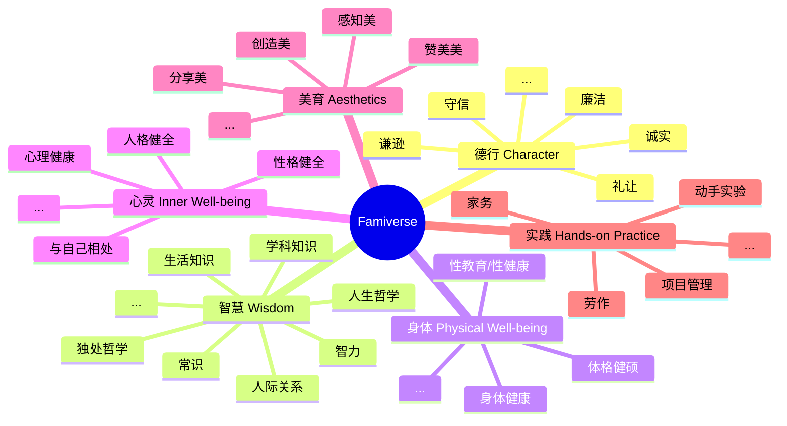

# Famiverse

一个专注于德行、智慧（不仅仅是智力）、身体、心灵、美育及实践全面、综合发展的家庭教育开源平台。是一群有爱的父母用代码为孩子编织的家庭教育小宇宙。与家长一起培养幸福的孩子。

在 **德行、智慧、身体、心灵、美育与实践** 六大星系中，孩子将与家长一起组队，像星际探险者一样自由探索，全面、综合地发展。

 

This is not just a platform—it's a home-spun galaxy, an open-source family education platform designed to foster the comprehensive development of **Character, Wisdom, Physical Well-being, Aesthetics, and Hands-on Practice**—woven from lines of code by loving parents. It's a constellation built for those they cherish most, helping parents nurture happy children.

Born for family education, this universe invites children not only to learn, but to awaken—to ignite their inner drive, explore the vast cosmos of curiosity, and plant the seeds of lifelong learning beneath stars filled with wonder. Across five luminous galaxies — **Character, Wisdom, Physical Well-being, Inner Well-being, Aesthetics, and Hands-on Practice** — children and their parents journey as explorers, side by side, charting their own constellations of meaning. They grow whole not through pressure, but through play, purpose, and shared discovery.

   

## Core Values

- **为家人发电：** 我们常用技术服务公司、服务他人，但其实技术同样可以回馈我们最亲爱的人。But the greatest gift our skills can offer isn't to the world — it's to the ones waiting at home.

- **Education Is Not About Grades:** We believe that the true purpose of education at home isn't to cram knowledge or chase test scores — it's to nurture in children the **ability, courage, confidence, and strength to seek happiness, appreciate beauty, and face the future**.当所有的知识都被遗忘，那些仍然沉淀在孩子心底的真实、美好和温暖，才是家庭教育真正的意义。

- **共建共享教育宇宙：** 我们坚信，每个家庭都是独一无二的闪亮星球，在 “家教宇宙（Famiverse）” ，我们共建、共学、共享。你可以学习、借鉴其他家庭的宝贵经验，也可以贡献自己的教育智慧。When each family dares to shine, we create a galaxy of hope — lighting the future for generations to come.

- **Absolute Privacy:** We believe that an educational ecosystem should be open, transparent, and fair — where every family's privacy is sacred and fully respected.We are fully committed to safeguarding your family's privacy. The Famiverse does not collect or sell any private data from your family.隐私数据始终存储在您的个人设备上，不与任何第三方共享。We ensure the privacy and data security of each family with the highest standards.Education can be co-built and shared, but privacy must be safeguarded.

 

- **Powering Our Loved Ones**: We spend our days building for clients, companies, and strangers. But the greatest gift our skills can offer isn't to the world — it's to the ones waiting at home.

- **Education Is Not About Grades**: We believe that the true purpose of education at home isn't to cram knowledge or chase test scores — it's to nurture in children the ability, courage, confidence, and strength to seek happiness, appreciate beauty, and face the future. Long after all knowledge fades, it's the quiet truths, the sense of beauty, and the lasting warmth in a child's heart that reveal the true purpose of family education.

- **Co-Creating an Educational Univers**: We believe that every family is a shining, one-of-a-kind planet. In the Famiverse, we learn together, build together, and grow together. You're free to draw from the lived experiences of other families — and contribute your own parenting wisdom to light the way for others. When each family dares to shine, we create a galaxy of hope — lighting the future for generations to come.

- **Absolute Privacy**: We believe that an educational ecosystem should be open, transparent, and fair — where every family's privacy is sacred and fully respected. We are fully committed to safeguarding your family's privacy. The Famiverse does not collect or sell any private data from your family. The privacy data is always encrypted and stored on your own device and is not shared with any third parties. We ensure the privacy and data security of each family with the highest standards. Education can be co-built and shared, but privacy must be safeguarded.

   

## Goal

- This platform is dedicated to **family education** and **lifelong learning**.
- 这个平台的用户是：孩子（主要是小学到高中毕业前）和孩子的家长。
- It aims to effectively **ignite a child's inner drive**, **nurture self-directed learning**, and help them build healthy, lifelong learning habits.
- This platform effectively helps children achieve a comprehensive and balanced development in **Character, Wisdom, Physical Well-being, Inner Well-being, Aesthetics, and Hands-on Practice**, guiding them to grow into a happy person, rather than just someone who is considered "excellent" in the eyes of others.
- 这个平台能够有效地培养孩子全面、综合的，跨学科的思维习惯和实践能力。
- 这个平台是一个真正的、无限延展的宇宙。It gives both children and parents the sense of **infinite possibility**, of **mystery waiting to be discovered**, and of a lifelong journey worth continuing.

   

## Project Status

- [x] [Project starts. Git things setup](https://github.com/betterme-billhoo/famiverse/issues/4)
- [ ] WIP: [头脑风暴：家庭教育中，如何才能系统地将德、智、体、心、美、劳全面、均衡发展落地？](https://github.com/betterme-billhoo/famiverse/discussions/20)
- [ ] WIP：技术架构
- [ ] WIP: 原型设计
- [ ] WIP: MVP 开发

   

## Core Architecture

- **六大星系**：这个宇宙由六大星系组成：德行、智慧、身体、心灵、美育和实践。各星系的具体名称待定。
  - Character Galaxy: Encompassing virtues such as humility, honesty, trustworthiness, courtesy, integrity, and more.
  - 智慧星系：包括但不限于智力、沟通能力、迁移能力、人际关系、跨学科思维、时间管理、生活常识、人生哲学等等。
  - 身体星系：包括但不限于身体健康、性教育、性健康等等。
  - 心灵星系：包括但不限于心理健康、性格健康、人格健全、认识自己、与自己独处等等。
  - Aesthetics Galaxy: A universe of perceiving, creating, sharing, and celebrating beauty in all its forms.
  - 实践星系：包括但不限于智慧星系中所有需要实践落地的内容、实验、劳作、家务、项目管理、时间管理等等。
- **家庭星球**：这是孩子进入这个宇宙的起点，家长和孩子将在这里起航，并可以随时返回。这里将记录这个家庭的点点滴滴，成为家庭私有的知识库和记忆宝库，满藏家庭的私有数据、成长回忆和珍贵记录。—a personal knowledge base and emotional treasure chest, like a privatized version of a family-only social space.
- **The Infinite Planets**:
  - 每个星系中有无数的星球，每个星球代表一个知识点、实践内容、亲子互动或一套结构化的课程。Planets are connected to one another across and within systems through rich, interdisciplinary relationships and discovery-based challenges. This fosters habits of **cross-disciplinary thinking** and **creative exploration**.
  - 每个星球是一个独立的包。每个人都可以在自己的电脑上轻松制作自己的星球并放进宇宙。如果愿意，每个人，不论是普通家长、开发者、教育人士，还是官方机构，都可以上传自己的星球到 Famiverse 服务器，将教育经验共享给其他家庭。
  - 每个人都可以在 Famiverse 的星球市场搜索并下载自己感兴趣的星球放进自己的家教宇宙。可以在市场中查看该星球的评分和其他家庭的实际使用感受，也可以分享自己对该星球的实际体验感受并打分供其他家庭参考。
  - 星球与星球之间存在星链。星链是相关知识、实践之间的跃迁路线，用于对知识的相关性以及顺序性进行抽象。
- **人工智能 MOSS**：进入这个宇宙的家长和孩子将获得一个人工智能伙伴 MOSS，它将是解读整个宇宙的入口，也是促进家庭教育落地和有效化的关键所在。
- **探索度系统**：包含迷雾系统和轨迹系统等。记录孩子在宇宙中的探索轨迹、兴趣等，并由 MOSS 进行科学的分析和评估。These insights will be shared with the child to foster self-awareness, and with parents for thoughtful guidance.MOSS 还将通过对这些数据的分析，为孩子自己以及家长分别提供个性化建议。

   

   

## Feature Vision

- 这是一个无限宇宙。每个家庭都是宇宙中的一颗星球。每个知识点，也是这个宇宙中的星球。家庭成员在这个宇宙中共建共享教育知识和理念。
- 所有人都有权创建自己的星球或者星链（系统学习路径），也有权投票选出先进的、实用的、被验证可靠的星球或星链。
- 每个星球将作为一个插件接入宇宙。有 Famiverse 官方的插件、家庭自作的插件、专业教育人士提供的插件，甚至教育部门的官方插件。Different contributors can create a variety of plugin extensions tailored for children of different age groups.插件的制作非常容易上手，面向非技术人员。
- A child's journey in this universe begins on the **Home Planet**, where they are guided by the system to meet their personal AI companion, **MOSS**.
- The **Home Planet** is the heart of the system. It is the emotional and educational anchor of the universe—a private family hub where precious memories, stories, photos, struggles, and reflections are safely preserved.This planet belongs to the **Aesthetic Galaxy**,and the child will always start from here and return here.
- With MOSS as their guide, the child learns of the existence of **five galactic systems**. They will be gently introduced to new planets within each system through a combination of structured guidance and free exploration. As they move between worlds, they learn, play, and apply their knowledge in meaningful ways.
- A **Fog of Discovery** blankets unexplored areas of the universe. As the child's knowledge and skills grow, the fog lifts—revealing new, relevant planets.For instance, once a child masters basic arithmetic, the system may automatically unlock a simple algebra planet.This adaptive progression has no age, class, or intelligence barriers—if the child is curious and capable, the universe is ready for them.Even if a primary school child self-learns software engineering and applies it creatively, the system will encourage and support that exploration.
- The fog system also handles **age-sensitive content** with care.For example, planets dealing with sex education within the Body Galaxy will only become visible once the child reaches a suitable developmental stage.Meanwhile, subjects like software engineering, artificial intelligence, or advanced mathematics are open to all who are ready to learn—regardless of age.
- MOSS 会根据孩子的学习进度和实践表现，智能地分析出孩子在六大维度（德、智、体、心、美、劳）上的综合评分表现，并分析出这个孩子的兴趣点所在。
- Using a structured knowledge framework, MOSS can **auto-generate new planets (plugins)** based on existing open content.While the internet is rich in information, it is often chaotic and unstructured. By following a well-designed, modular system, MOSS can transform this content into meaningful, structured learning journeys.
- **Parents** play an active role in the universe. Through collaborative quests and co-learning challenges—like science experiments or family chores—parents and children progress together, unlocking new planets and earning rewards (points, tokens, etc.).Education becomes a shared adventure.
- The system will offer **badges and blockchain-based certificates** to recognize learning achievements.These certificates aim to one day be **interoperable with real-world education credentials**,helping to bridge the gap between traditional systems and next-generation learning.
- The universe will be **integrated with traditional education systems**. Progress made in real life (e.g., learning multiplication in school) will reflect in the universe (e.g., unlocking the multiplication planet), and vice versa. Children will move freely between physical and virtual learning spaces.
- Supported platforms include **Web, Android, iOS, AR, and VR**.In particular, **VR** will become a key platform for immersive and experiential learning in the future.

   

## Who Is It For?

- **孩子**：小学到高中阶段为主，但仍支持成年后继续使用宇宙进行更高阶知识的探索。
- **家长**：与孩子共同进入宇宙，共同完成家庭任务和实践挑战，引导家庭进行良性循环的亲子教育。

   

## Roadmap

[Famiverse Roadmap](https://github.com/users/betterme-billhoo/projects/1)

   

## Getting Started

This project is still in its early planning and design phase — but you're warmly welcome to get involved from the very beginning:

1. Read our [Goal](README-en.md#goal), [Feature Vision](README-en.md#feature-vision), and [Roadmap](https://github.com/users/betterme-billhoo/projects/1).
2. Review our [Contributor Agreement](CONTRIBUTOR_AGREEMENT-en.md) to understand how to participate in development or contribute educational content.
3. ⭐ Star this repository to stay updated.
4. Open an issue to share your ideas or suggestions — we'd love to hear from you.

   

## Contribution Guide

We welcome contributors from all backgrounds and disciplines:

- 👨‍💻 Frontend / Backend Developers
- 📚 Educational Content Creators
- 🎨 UI/UX Designers & Illustrators
- 🌍 Multilingual Translators
- 👩‍🏫 Parents, Teachers, and Education Professionals

Please read the full [Contributor Guide](CONTRIBUTION-en.md) to learn how to get involved.

   

## License

This project is licensed under the [Apache 2.0 License](LICENSE), which allows for commercial use, modification, and redistribution.

