# Famiverse

This is not just a platform—it's a home-spun galaxy, an open-source family education universe designed to foster the comprehensive development of **Character, Wisdom, Physical Well-being, Inner Well-being, Aesthetics, and Hands-on Practice**,woven from lines of code by loving parents.与家长一起培养幸福的孩子，而不是教育内卷的牺牲品。

在 **德行、智慧、身体、心灵、美育与实践** 六大星系中，孩子将与家长一起组队，像星际探险者一样自由探索，全面、综合地发展。

 

This is not just a platform—it's a home-spun galaxy, an open-source family education platform designed to foster the comprehensive development of **Character, Wisdom, Physical Well-being, Aesthetics, and Hands-on Practice**—woven from lines of code by loving parents. It's a constellation built for those they cherish most, helping parents nurture happy children, not mere victims of the educational rat race.

Born for family education, this universe invites children not only to learn, but to awaken—to ignite their inner drive, explore the vast cosmos of curiosity, and plant the seeds of lifelong learning beneath stars filled with wonder. Across five luminous galaxies — **Character, Wisdom, Physical Well-being, Inner Well-being, Aesthetics, and Hands-on Practice** — children and their parents journey as explorers, side by side, charting their own constellations of meaning. They grow whole not through pressure, but through play, purpose, and shared discovery.

   

## Core Values

- **Powering Our Loved Ones:** We spend our days building for clients, companies, and strangers.But the greatest gift our skills can offer isn't to the world — it's to the ones waiting at home.

- **Education Is Not About Grades:** We believe that the true purpose of education at home isn't to cram knowledge or chase test scores — it's to nurture in children the **ability, courage, confidence, and strength to seek happiness, appreciate beauty, and face the future**.Long after all knowledge fades, it's the quiet truths, the sense of beauty, and the lasting warmth in a child's heart that reveal the true purpose of family education.

- **Co-Creating an Educational Univers:** We believe that every family is a shining, one-of-a-kind planet. In the Famiverse, we learn together, build together, and grow together.In the Famiverse, you're free to draw from the lived experiences of other families — and contribute your own parenting wisdom to light the way for others.When each family dares to shine, we create a galaxy of hope — lighting the future for generations to come.

- **Absolute Privacy:** We believe that an educational ecosystem should be open, transparent, and fair — where every family's privacy is sacred and fully respected.We are fully committed to safeguarding your family's privacy. The Famiverse does not collect or sell any private data from your family.The privacy data is always stored on your own device and is not shared with any third parties.We ensure the privacy and data security of each family with the highest standards.Education can be co-built and shared, but privacy must be safeguarded.

 

- **Powering Our Loved Ones**: We spend our days building for clients, companies, and strangers. But the greatest gift our skills can offer isn't to the world — it's to the ones waiting at home.

- **Education Is Not About Grades**: We believe that the true purpose of education at home isn't to cram knowledge or chase test scores — it's to nurture in children the ability, courage, confidence, and strength to seek happiness, appreciate beauty, and face the future. Long after all knowledge fades, it's the quiet truths, the sense of beauty, and the lasting warmth in a child's heart that reveal the true purpose of family education.

- **Co-Creating an Educational Univers**: We believe that every family is a shining, one-of-a-kind planet. In the Famiverse, we learn together, build together, and grow together. You're free to draw from the lived experiences of other families — and contribute your own parenting wisdom to light the way for others. When each family dares to shine, we create a galaxy of hope — lighting the future for generations to come.

- **Absolute Privacy**: We believe that an educational ecosystem should be open, transparent, and fair — where every family's privacy is sacred and fully respected. We are fully committed to safeguarding your family's privacy. The Famiverse does not collect or sell any private data from your family. The privacy data is always encrypted and stored on your own device and is not shared with any third parties. We ensure the privacy and data security of each family with the highest standards. Education can be co-built and shared, but privacy must be safeguarded.

   

## Goal

- This platform is dedicated to **family education** and **lifelong learning**.
- It is designed for two core users: **children** (from K12 through adulthood) and their **parents**.
- It aims to effectively **ignite a child's inner drive**, **nurture self-directed learning**, and help them build healthy, lifelong learning habits.
- This platform effectively helps children achieve a comprehensive and balanced development in **Character, Wisdom, Physical Well-being, Inner Well-being, Aesthetics, and Hands-on Practice**, guiding them to grow into a happy person, rather than just someone who is considered "excellent" in the eyes of others.
- It encourages **interdisciplinary thinking** and **practical skills**, helping children develop a mind that is curious, connected, and creative.
- This platform is a **universe**—a truly boundless, ever-expanding cosmos.It gives both children and parents the sense of **infinite possibility**, of **mystery waiting to be discovered**, and of a lifelong journey worth continuing.

   

## Project Status

- [x] [Project starts. Git things setup](https://github.com/betterme-billhoo/famiverse/issues/4)
- [ ] Brainstorming](https://github.com/betterme-billhoo/famiverse/discussions/20)
- [ ] Prototype
- [ ] Architecture
- [ ] MVP development.

   

## Core Architecture

- **六大星系**：这个宇宙由六大维度组成：德行、智慧（包括但不只是智力）、身体、心灵、美育和实践。Each dimension forms a unique **galactic system**, with final naming to be determined.
  - Character Galaxy: Encompassing virtues such as humility, honesty, trustworthiness, courtesy, integrity, and more.
  - 智慧星系：包括但不限于智力、人际关系、非暴力沟通、各学科知识、生活知识、常识、人生哲学等等。
  - 身体星系：包括但不限于身体健康、体格健硕、性教育、性健康等等。
  - 心灵星系：包括但不限于心理健康、性格健康、人格健全、与自己相处等等。
  - Aesthetics Galaxy: A universe of perceiving, creating, sharing, and celebrating beauty in all its forms.
  - Hands-on Practice Galaxy: Encompassing hands-on experiments, project management, household tasks, manual work, and more.
- **The Home Planet**: This is where every child begins their journey—a shared starting point for children and their parents. Families can return here at any time.It will become a private archive of the family's growth, memories, and reflections—a personal knowledge base and emotional treasure chest, like a privatized version of a family-only social space.
- **The Infinite Planets**:
  - Each galactic system contains countless planets, where each planet represents a knowledge point, a practical task, or a structured learning module.Planets are connected to one another across and within systems through rich, interdisciplinary relationships and discovery-based challenges. This fosters habits of **cross-disciplinary thinking** and **creative exploration**.
  - Technically, **each planet is a plugin**.Famiverse will provide an initial collection of core educational planets,but over time the plugin system will be opened to the community—allowing developers, educators, and even non-technical contributors to create and share educational content.Together, we will co-create an ever-expanding, structured knowledge universe.
- **MOSS, the AI Companion**: Every child who enters the universe will be accompanied by an intelligent, personal companion named **MOSS**—an AI partner that supports, responds, and grows with them throughout their journey.
- **Exploration System**: Includes both a **fog of war** system and a **journey tracker**.It will track each child’s learning path, interests, and progress, providing meaningful, data-driven insights.These insights will be shared with the child to foster self-awareness, and with parents for thoughtful guidance.MOSS will offer **personalized recommendations** based on these insights, supporting both the learner and their family.

```mermaid
---
config:
  theme: mc
---
mindmap
  root((Famiverse))
    德行 Character
      谦逊
      诚实
      守信
      礼让
      廉洁
      ...
    智慧 Wisdom
      智力
      人际关系
      学科知识
      生活知识
      常识
      人生哲学
      独处哲学
      ...
    身体 Physical Well-being
      身体健康
      体格健硕
      性教育/性健康
      ...
    心灵 Inner Well-being
      心理健康
      性格健全
      人格健全
      与自己相处
      ...
    美育 Aesthetics
      感知美
      创造美
      分享美
      赞美美
      ...
    实践 Hands-on Practice
      动手实验
      项目管理
      家务
      劳作
      ...
```

   

   

## Feature Vision

- 这是一个无限宇宙。每个家庭都是宇宙中的一颗星球。每个知识点，也是这个宇宙中的星球。家庭成员在这个宇宙中共建共享教育知识和理念。
- 所有人都有权利创建自己的星球或者星链（系统学习路径），也有权利投票选出先进的、实用的、被验证可靠的星球或星链。
- 每个星球将作为一个插件接入宇宙。有 Famiverse 官方的插件、家庭自作的插件、专业教育人士提供的插件，甚至教育部门的官方插件。Different contributors can create a variety of plugin extensions tailored for children of different age groups.插件的制作非常容易上手，面向非技术人员。
- A child's journey in this universe begins on the **Home Planet**, where they are guided by the system to meet their personal AI companion, **MOSS**.
- The **Home Planet** is the heart of the system. It is the emotional and educational anchor of the universe—a private family hub where precious memories, stories, photos, struggles, and reflections are safely preserved.This planet belongs to the **Aesthetic Galaxy**,and the child will always start from here and return here.
- With MOSS as their guide, the child learns of the existence of **five galactic systems**. They will be gently introduced to new planets within each system through a combination of structured guidance and free exploration. As they move between worlds, they learn, play, and apply their knowledge in meaningful ways.
- A **Fog of Discovery** blankets unexplored areas of the universe. As the child's knowledge and skills grow, the fog lifts—revealing new, relevant planets.For instance, once a child masters basic arithmetic, the system may automatically unlock a simple algebra planet.This adaptive progression has no age, class, or intelligence barriers—if the child is curious and capable, the universe is ready for them.Even if a primary school child self-learns software engineering and applies it creatively, the system will encourage and support that exploration.
- The fog system also handles **age-sensitive content** with care.For example, planets dealing with sex education within the Body Galaxy will only become visible once the child reaches a suitable developmental stage.Meanwhile, subjects like software engineering, artificial intelligence, or advanced mathematics are open to all who are ready to learn—regardless of age.
- MOSS 会根据孩子的学习进度和实践表现，智能地分析出孩子在六大维度（德、智、体、心、美、劳）上的综合评分表现，并分析出这个孩子的兴趣点所在。
- Using a structured knowledge framework, MOSS can **auto-generate new planets (plugins)** based on existing open content.While the internet is rich in information, it is often chaotic and unstructured. By following a well-designed, modular system, MOSS can transform this content into meaningful, structured learning journeys.
- **Parents** play an active role in the universe. Through collaborative quests and co-learning challenges—like science experiments or family chores—parents and children progress together, unlocking new planets and earning rewards (points, tokens, etc.).Education becomes a shared adventure.
- The system will offer **badges and blockchain-based certificates** to recognize learning achievements.These certificates aim to one day be **interoperable with real-world education credentials**,helping to bridge the gap between traditional systems and next-generation learning.
- The universe will be **integrated with traditional education systems**. Progress made in real life (e.g., learning multiplication in school) will reflect in the universe (e.g., unlocking the multiplication planet), and vice versa. Children will move freely between physical and virtual learning spaces.
- Supported platforms include **Web, Android, iOS, AR, and VR**.In particular, **VR** will become a key platform for immersive and experiential learning in the future.

   

## Who Is It For?

- **Children**: Primarily designed for learners from elementary to high school, though the universe continues to grow with them—supporting deeper exploration even through university and beyond.
- **Parents**: Active companions on the journey. They enter the universe alongside their children, taking part in collaborative family missions and practical challenges, nurturing a cycle of positive, connected, and joyful parent-child learning.

   

## Roadmap

[Famiverse Roadmap](https://github.com/users/betterme-billhoo/projects/1)

   

## Getting Started

This project is still in its early planning and design phase — but you're warmly welcome to get involved from the very beginning:

1. Read our [Goal](README-en.md#goal), [Feature Vision](README-en.md#feature-vision), and [Roadmap](https://github.com/users/betterme-billhoo/projects/1).
2. Review our [Contributor Agreement](CONTRIBUTOR_AGREEMENT-en.md) to understand how to participate in development or contribute educational content.
3. ⭐ Star this repository to stay updated.
4. Open an issue to share your ideas or suggestions — we'd love to hear from you.

   

## Contribution Guide

We welcome contributors from all backgrounds and disciplines:

- 👨‍💻 Frontend / Backend Developers
- 📚 Educational Content Creators
- 🎨 UI/UX Designers & Illustrators
- 🌍 Multilingual Translators
- 👩‍🏫 Parents, Teachers, and Education Professionals

Please read the full [Contributor Guide](CONTRIBUTION-en.md) to learn how to get involved.

   

## License

This project is licensed under the [Apache 2.0 License](LICENSE), which allows for commercial use, modification, and redistribution.

