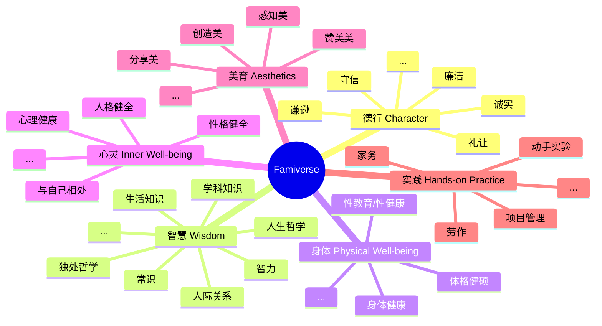

# 家教宇宙 | Famiverse

一个专注于德行、智慧（不仅仅是智力）、身体、心灵、美育及实践全面发展的家庭教育开源平台。是一群有爱的父母用代码为孩子编织的家庭小宇宙。与家长一起培养幸福的孩子，而不是教育内卷的牺牲品。

它致力于激发孩子的内驱力，培养他们自主探索的能力和终身学习的好习惯。在 **德行、智慧、身体、心灵、美育与实践** 六大星系中，孩子将与家长一起组队，像星际探险者一样自由探索，全面、综合地发展。  

 

This is not just a platform—it's a home-spun galaxy, an open-source family education platform designed to foster the comprehensive development of **Character, Wisdom, Physical Well-being, Aesthetics, and Hands-on Practice**—woven from lines of code by loving parents. It's a constellation built for those they cherish most, helping parents nurture happy children, not mere victims of the educational rat race.

Born for family education, this universe invites children not only to learn, but to awaken—to ignite their inner drive, explore the vast cosmos of curiosity, and plant the seeds of lifelong learning beneath stars filled with wonder. Across five luminous galaxies — **Character, Wisdom, Physical Well-being, Inner Well-being, Aesthetics, and Hands-on Practice** — children and their parents journey as explorers, side by side, charting their own constellations of meaning. They grow whole not through pressure, but through play, purpose, and shared discovery.

   

## 核心价值观 | Core Values ([English](README-en.md#Core-Values))
- **为家人发电：** 我们常用技术服务公司、服务他人，但其实，技术同样可以回馈我们最亲爱的人。在为孩子和家人创造更多幸福与机会的过程中，技术可以成为一束温暖有爱的光。
  
- **教育的目的不是分数** 我们坚信，家庭教育的目的不是灌输知识，也不是内卷成绩，而是赋予孩子：**追求幸福、感知美好以及面对未来的勇气、能力与信心**。当所有的知识都被遗忘，那些仍然沉淀在孩子心底的真实、美好和温暖，才是家庭教育的真正意义。
  
- **共建共享教育宇宙：** 我们坚信，每个家庭都是独一无二的闪亮星球，在“家教宇宙（Famiverse）”，我们共建、共学、共享。你可以学习、借鉴其他家庭的宝贵经验，也可以贡献自己家的教育智慧。让我们用每个家庭的微光，照亮自己及更多家庭的未来。
  
- **绝对隐私：** 我们坚信，教育生态应当开源、透明、公正。“家教宇宙（Famiverse）” 不收集或出售任何家庭的隐私数据。隐私数据始终存储在您自己的设备上，不与任何第三方共享。我们以最严苛的方式保障每个家庭的隐私和数据安全。教育可以共建共享，隐私必须得到守护。

 

- We often use technology to serve others and companies. But in our quiet hours, we can also use it to build something meaningful for our own children and families—something that brings them more happiness, more possibilities.
- We believe that the true purpose of family education is not to cram knowledge or chase test scores, but to nurture the **courage**, **capacity**, and **conviction** to pursue happiness, appreciate beauty, and face the future. When all the facts and formulas are forgotten, what remains in a child's heart—the warmth, the values, the sense of wonder—that is what matters most, and what we strive to cultivate.
  
   

## 目标 | Goal ([English](README-en.md#Goal))

- 这个平台专注于家庭教育和终身学习。
- 这个平台的用户是：孩子（小学到大学，甚至到未来长大成人）和孩子的家长。
- 这个平台能够有效地激发孩子的内驱力，培养孩子的自学能力，帮助他们养成终身学习的好习惯。
- 这个平台能够有效地帮助孩子实现德、智、体、心、美、劳全面、均衡发展，引导他们成长为一个幸福的人，而不仅仅是“别人眼中优秀的人”。
- 这个平台能够有效地培养孩子全面的、综合的、跨学科的思维习惯和实践能力，引导他成长为一个全面的、综合发展的人。
- 这个平台将是一个宇宙，一个真正的、无限延展的宇宙。这个宇宙带给孩子和家长的感觉是“无限的”，“充满未知的”，以及“始终想要继续探索、学习的”。

   

## 项目状态 | Project Status ([English](README-en.md#Project-Status))

- [X] [立项，完成基本的 Git 配置和项目结构组织 | Project starts. Git things setup](https://github.com/betterme-billhoo/famiverse/issues/4)
- [ ] [头脑风暴：家庭教育中，如何才能系统地将德、智、体、美、劳全面、均衡发展落地？](https://github.com/betterme-billhoo/famiverse/discussions/20)
- [ ] 原型设计
- [ ] 技术架构确定
- [ ] MVP 开发

   
  
## 核心架构 | Core Architecture ([English](README-en.md#Core-Architecture))
- **六大星系**：这个宇宙由六大维度组成：德行、智慧（包括但不只是智力）、身体、心灵、美育和实践。每个维度是一个星系，各星系的具体名称待定。
  - 德行星系：包括但不限于谦逊、诚实、守信、礼让、廉洁等等。
  - 智慧星系：包括但不限于智力、人际关系、非暴力沟通、各学科知识、生活知识、常识、人生哲学等等。
  - 身体星系：包括但不限于身体健康、体格健硕、性教育、性健康等等。
  - 心灵星系：包括但不限于心理健康、性格健康、人格健全、与自己相处等等。
  - 美育星系：包括但不限于感知美、创造美、分享美、赞美美等等。
  - 实践星系：包括但不限于动手实验、项目管理、家务、劳作等等。
- **家庭星球**：这是孩子进入这个宇宙的最初的地方，家长和孩子将在这里起航，并可以随时返回这里。这里将记录这个家庭的点点滴滴，成为家庭私有的知识库和记忆宝库，满藏家庭的私有数据、回忆和珍贵记录。类似私有化的 QQ 空间。
- **无限星球**：
  - 每个星系中有无数的星球，每个星球代表一个知识点、实践内容或一套结构化的课程。星球与星球之间、星球与星系之间，有着千丝万缕的联系和谜题挑战，培养孩子进行跨学科思考的习惯。
  - 技术上，每个星球都是一个插件。Famiverse 官方将标配最初的、最实用的一些星球插件。后续将开放插件系统，允许开发者，甚至是不懂技术的教育人士，自行提供教育内容。最终形成无限的、结构化的知识宇宙。
- **人工智能 MOSS**：进入这个宇宙的孩子将获得一个人工智能伙伴 MOSS，它将陪伴孩子探索整个宇宙。
- **探索系统**：包含迷雾系统和轨迹记录系统。记录孩子在宇宙中的探索轨迹、兴趣等，并进行科学的分析和评估。将报告及时反馈给孩子自己，也供家长参考。人工智能 MOSS 将通过对这些数据的分析，为孩子自己以及家长分别提供个性化建议。

   

   

## 功能愿景 | Feature Vision ([English](README-en.md#Feature-Vision))
- 孩子在这个宇宙中，最开始从“家庭星球”出发，然后通过系统引导，获得自己的人工智能伙伴 MOSS。
- “家庭星球”是这个系统至关重要的一部分，这个宇宙要负责保存和维护家庭的点点滴滴。家庭的照片、故事、成长经历、挫折、知识库等等。这个星球属于“美育星系”。孩子从这个星球出发，也会回到这个星球。
- 在 MOSS 的帮助下，孩子得知这个宇宙存在五大星系，然后他将通过系统的引导以及自己的探索，逐步涉足每个星系，以及每个他感兴趣的星球，并在此期间完成相关内容的学习和实践。
- 宇宙存在迷雾，根据孩子自己的学习进度和学科知识储备程度的不同，系统将动态地解锁相应的迷雾。比如，孩子已经学会了加减乘除法，那么系统可能会自适应地点亮最简单的一次方程星球，以此类推。只要他想学、学得会，这个宇宙永远为他准备着新东西，没有年龄、智力、阶级的门槛。如果他小学就通过自学掌握了软件工程的专业知识，并灵活运用于生活实际，那是他自己的才能，宇宙不会限制他进行探索和学习，只要他愿意，一切由他的学习进度来动态调节。
- 迷雾系统会对某些敏感话题进行分级。比如“身体星系”将存在“性教育星球”，这个星球将需要等到适当的年龄后，才会让孩子注意到，以此类推。但其他的并不敏感的知识，比如软件工程、人工智能、高等数学等等，只要他自己想学、学得会，都是直接开放的。
- MOSS 会根据孩子的学习进度和实践表现，智能地分析出孩子在六大维度（德、智、体、心、美、劳）上的综合评分表现，并分析出这个孩子的兴趣点所在。
- 系统将按照我们设计的知识体系模板，通过 MOSS 自动生成新的星球（插件），很多知识互联网已经讲得非常清楚了，没有必要靠人工来制作。但互联网上的知识是杂乱无章的，我们需要设计一套稳定、规范的知识体系构建规则，让 MOSS 遵循这样的规则去生成对应的星球。
- 家长作为宇宙中的另外一个参与方，与孩子始终保持互动。在一些特殊的学习环节、特别的知识点上共同作业，攻克难关，从而共同学习，解锁未知星球，获得星球上的奖励（比如系统的积分或者代币）。比如共同做实验、共同完成一个家务的挑战等等。
- 系统拥有徽章、证书机制。孩子在宇宙中学习完相应的知识结构并通过检测后，系统将颁发基于区块链技术的证书。这些证书，我希望将来可以与现实世界的教育系统证书进行类比和对接，最终等价于现实世界的教育证书，从而优化甚至可能影响整个传统教育模式。
- 宇宙的每个星球将作为一个插件，有 Famiverse 官方的插件、家庭自作的插件、专业教育人士提供的插件，甚至教育部门的官方插件。不同角色可以为不同年龄段的孩子做各种各样的插件扩展。插件的制作必须非常容易上手，要面向非技术人员。
- 整个宇宙的探索进度也可以与现实的教育系统打通，让孩子在虚拟宇宙和现实传统教育模式中自由顺畅的切换。比如孩子在小学已经学习了加减乘除，那么宇宙中对应的星球将自动完成探索。
- 支持的平台：Web、Android、iOS、AR 以及 VR。尤其是 VR 系统，将作为以后的主推系统之一。

   

## 用户 | Who Is It For? ([English](README-en.md#Who-Is-It-For))
- **孩子**：小学到高中阶段为主，大学以后依然可以继续使用宇宙进行更高阶的探索。
- **家长**：与孩子共同进入宇宙，共同完成家庭任务和实践挑战，引导进行良性循环的亲子教育。

   

## 项目路线图 | Roadmap ([English](README-en.md#Roadmap))
[Famiverse 路线图](https://github.com/users/betterme-billhoo/projects/1)

   

## 快速开始 | Getting Started ([English](README-en.md#Getting-Started))
目前项目尚在规划和设计阶段，但你仍可以提前加入：

1. 阅读我们的 [目标](README.md#目标--goal)、[愿景](README.md#功能愿景--feature-vision) 和 [路线图](https://github.com/users/betterme-billhoo/projects/1)。
2. 阅读我们的 [贡献者协议](CONTRIBUTOR_AGREEMENT.md)，准备加入开发或内容贡献。
3. Star 本项目，保持关注。
4. 提出 Issue 分享你的建议。

   

## 贡献指南 | Contribution Guide ([English](README-en.md#Contribution-Guide))

我们欢迎来自各领域的贡献者：

- 👨‍💻 前端/后端开发者
- 📚 教育课程创作者
- 🎨 UI/UX 设计师 & 插画师
- 🌍 多语言翻译者
- 👩‍🏫 家长、老师、教育部门

请阅读完整的 [贡献者指南 (TO DO)](CONTRIBUTION.md) 了解如何参与进来。

   

## 开源协议 | License ([English](README-en.md#License))

本项目基于 [Apache 2.0 License](LICENSE) 协议开源，支持商业使用、修改和再发布。

